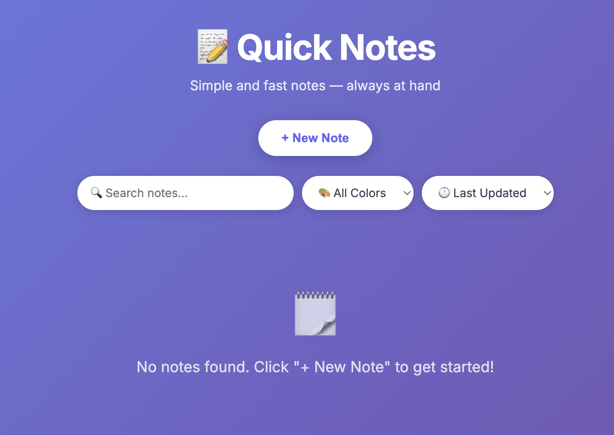
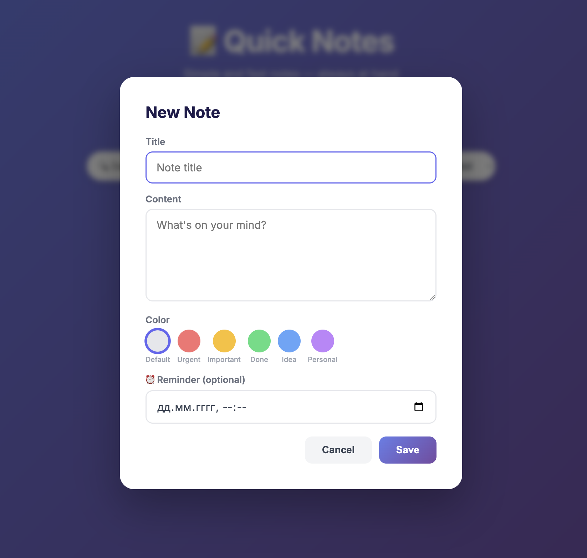
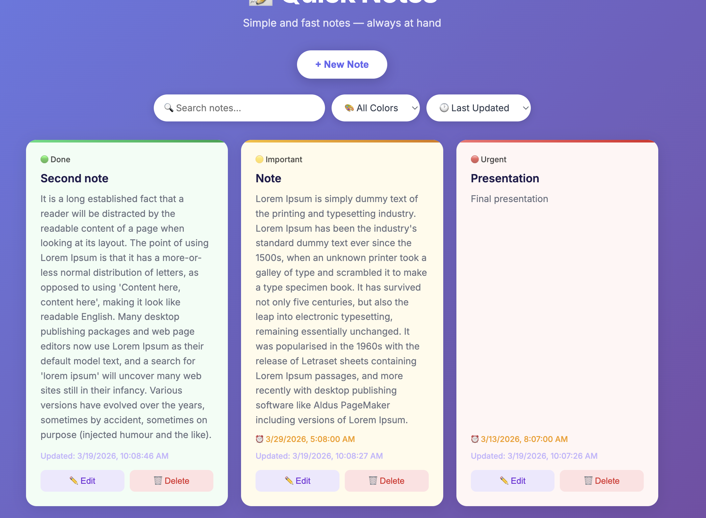
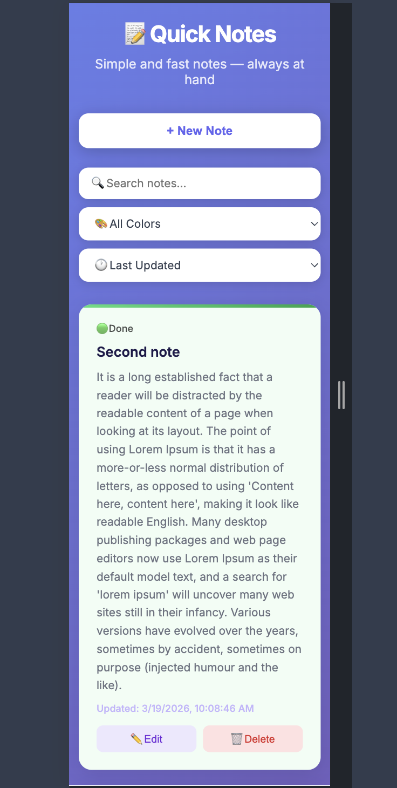

# 📝 Quick Notes

A lightweight web application for managing personal notes — built with Django REST Framework.


---

## 📸 Screenshots

### Main Page


### Create / Edit Note


### Note Colors


### Mobile View


---

## 🚀 Features

- ✅ Create, Read, Update, Delete notes (full CRUD)
- 🔍 Search notes by title or content
- 🎨 Color labels — Urgent, Important, Done, Idea, Personal
- ⏰ Reminders with browser notifications
- 📱 Fully responsive (mobile-friendly)
- ⚡ REST API with JSON responses

---

## 🛠 Tech Stack

| Layer     | Technology              |
|-----------|-------------------------|
| Backend   | Django 4.x              |
| API       | Django REST Framework   |
| Database  | SQLite                  |
| Frontend  | HTML / CSS / JavaScript |

---

## ⚙️ Installation & Setup

### 1. Clone the repository
```bash
git clone https://github.com/Adil-Bikiev/Quick-Notes.git
cd quick-notes
```

### 2. Create virtual environment
```bash
python -m venv venv
source venv/bin/activate      # Mac/Linux
venv\Scripts\activate         # Windows
```

### 3. Install dependencies
```bash
pip install django djangorestframework
```

### 4. Apply migrations
```bash
python manage.py makemigrations
python manage.py migrate
```

### 5. Create superuser (optional)
```bash
python manage.py createsuperuser
```

### 6. Run the server
```bash
python manage.py runserver
```

Open [http://127.0.0.1:8000](http://127.0.0.1:8000) in your browser.

---

## 🔗 API Endpoints

| Method   | Endpoint              | Description      |
|----------|-----------------------|------------------|
| `GET`    | `/api/notes/`         | List all notes   |
| `POST`   | `/api/notes/`         | Create a note    |
| `GET`    | `/api/notes/{id}/`    | Retrieve a note  |
| `PUT`    | `/api/notes/{id}/`    | Update a note    |
| `DELETE` | `/api/notes/{id}/`    | Delete a note    |

---

## 📁 Project Structure

```
quick-notes/
├── quickNotes/           # Django project config
│   ├── settings.py
│   ├── urls.py
│   └── wsgi.py
├── quickNotesApp/        # Main app
│   ├── models.py         # Note model
│   ├── serializers.py    # DRF serializer
│   ├── views.py          # ViewSet
│   ├── urls.py           # Router
│   └── admin.py          # Admin config
├── templates/
│   └── index.html        # Frontend
├── manage.py
└── README.md
```

---

## 🎨 Note Colors

| Color  | Meaning   |
|--------|-----------|
| ⚪ White  | Default   |
| 🔴 Red    | Urgent    |
| 🟡 Yellow | Important |
| 🟢 Green  | Done      |
| 🔵 Blue   | Idea      |
| 🟣 Purple | Personal  |

---
